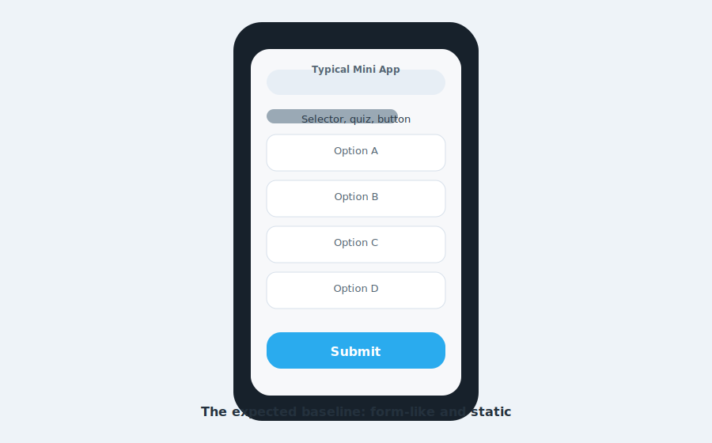
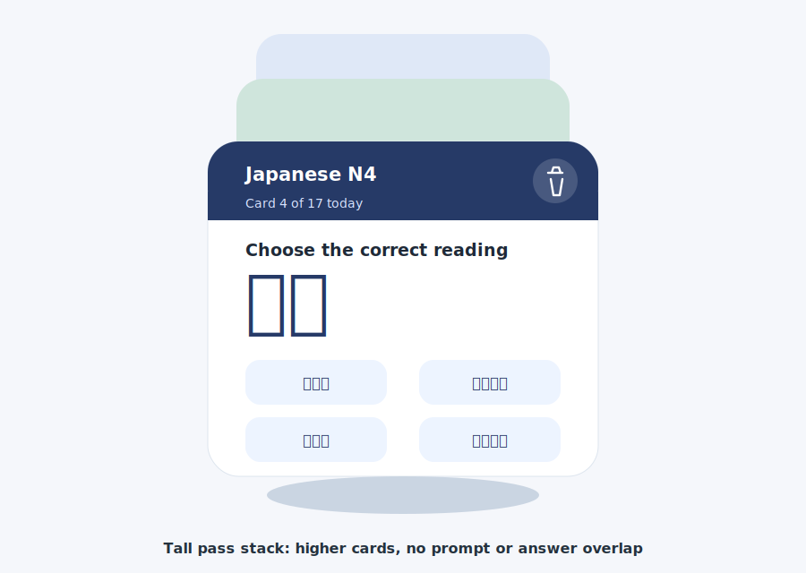
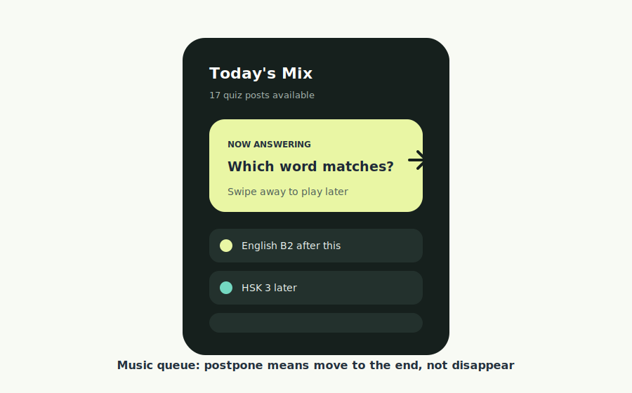
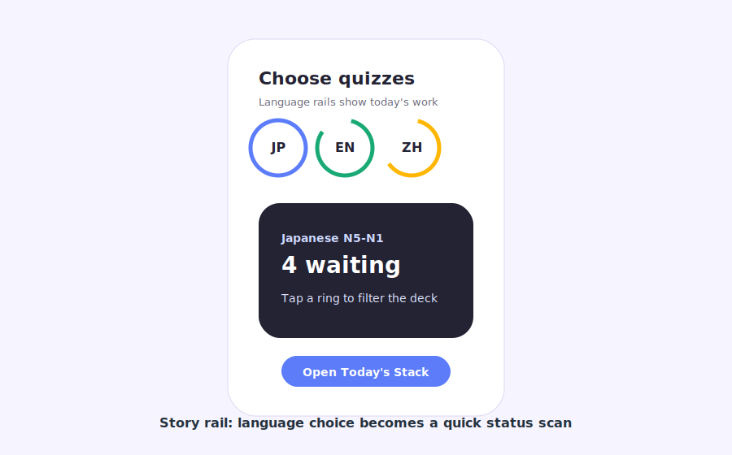
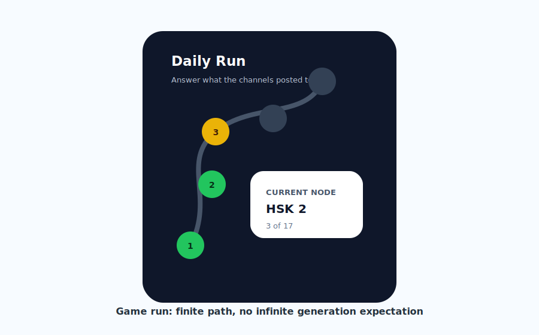
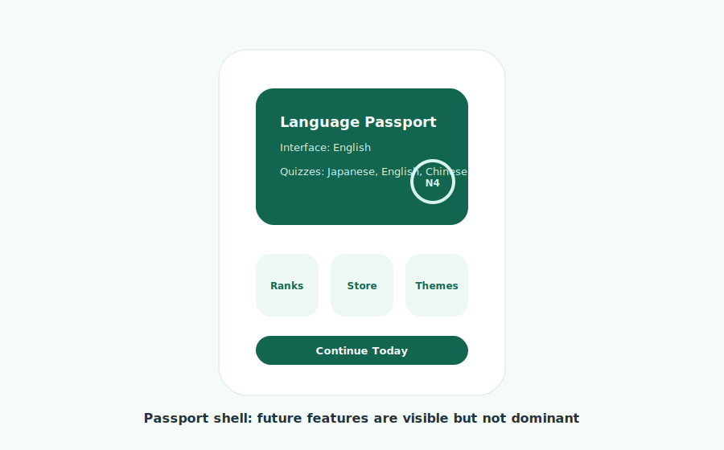

# Design Brainstorm: Telegram Mini App Quiz UI

## TL;DR
Prototype a three-screen hierarchy: **Language Rail** as the parent dashboard, **Daily Run Map** after the user chooses a language and level, and a taller **Pass Stack** for actual quiz answering. This fits the real product rule: the bot posts a finite set of daily quizzes, and the user does not generate endless new ones.

## Source And Tooling Note
Lazyweb MCP is not installed. Enable the global Lazyweb plugin or get the free setup instructions at https://www.lazyweb.com/mcp-install, paste them into this agent, then rerun this skill. Lazyweb is free; the bearer token is only for no-billing UI reference tools and is okay in ignored local config.

The local Lazyweb screenshot helper also returned `NO_BROWSE`, so live screenshot capture was unavailable. I used web research, the current repo, the nearby `SenseiPublisherBot` code, and source-backed sketches saved in `references/`.

## Which Ideas To Prototype

| Idea | Novelty | Feasibility | Verdict |
|------|---------|-------------|---------|
| Story Rail Language Picker | Medium | High | Parent screen |
| Daily Run Map | High | High | Language + level detail screen |
| Wallet Pass Stack | High | High | Quiz answering screen |
| Music Queue Deck | Medium | High | Behavior model inside stack |
| Language Passport Shell | Medium | High | Future profile/store frame |
| Museum Card With Explanation Placard | High | Medium | Wild card |

## The Obvious Approach
Most simple Telegram Mini Apps become a form: language selector, question text, four option buttons, and a submit button. Your current `index.html` is still the vanilla Telegram sample, so the baseline would naturally drift toward that.


*Typical baseline: selector, quiz, button. Easy to build, but not memorable.*

This baseline is safe, but it fails three important product truths:

- A user has a finite queue for today, not an infinite quiz generator.
- Dismissed cards must return later, not vanish.
- The future surface needs room for leaderboards, store, themes, and customizations.

## Product Frame

### Platform Constraints
GitHub Pages is a fit for the static shell because it publishes HTML, CSS, and JavaScript from a repository as a static site: https://docs.github.com/en/pages/getting-started-with-github-pages/what-is-github-pages

Telegram Mini Apps give you useful native chrome: theme variables, viewport values, BackButton, MainButton, SecondaryButton, SettingsButton, haptics, and storage APIs: https://core.telegram.org/bots/webapps

Important Telegram detail: a Mini App opened from a keyboard button can send data back to the bot with `Telegram.WebApp.sendData`, and direct links can pass `startapp` parameters. That means the GitHub Pages app can stay static while the Python bot remains the source of truth for quiz state and answer handling.

### Data Reality
The bot already supports generated quiz items with:

- `question`
- `options`
- `correct_index`
- optional `explanation`

For a casual quiz view, the client can render this directly. For leaderboards or anti-cheat scoring, the client should not be trusted to judge correctness. Send `{quiz_id, selected_index, action}` to the bot/backend and let the bot record the result.

## IA Recommendation

### Chosen Screen Hierarchy
Use the brainstorm ideas as a product flow, not as competing concepts:

```text
First launch
  -> Interface language: English / Russian
  -> Parent: Language Rail dashboard
  -> Detail: Daily Run Map for selected language + level
  -> Answering: Tall Pass Stack
  -> Result / explanation
  -> Back to Daily Run Map or next card
```

### First Launch
Use a two-step setup:

1. Interface language: English or Russian.
2. Quiz languages: Japanese, English, Chinese.

Default the interface language from Telegram `user.language_code` when available, but let the user override it. Store preference in Telegram DeviceStorage when supported and `localStorage` as fallback.

### Parent Screen: Language Rail
The first screen after setup should be the common-user dashboard, especially for users with several selected languages:

- Header: today summary, compact settings icon, optional profile/passport button.
- Center: language rings for Japanese, English, Chinese, and future languages.
- Language card: selected language, chosen levels, waiting count, done count.
- Action: "Open run" or "Continue".
- Future dock: leaderboard, store, themes, profile. Keep these visible but secondary.

### Detail Screen: Daily Run Map
After the user chooses a language and level, the Daily Run Map becomes the best screen. It shows the finite path for that selected track: `Japanese N4`, `English B2`, `Chinese HSK 2`, etc.

- Nodes represent already-posted quiz items.
- Done nodes, current node, later nodes, and refused nodes must be visually distinct.
- Tapping the current or waiting node opens the pass stack.
- This screen prevents the wrong mental model: users see today's finite route rather than expecting infinite generation.

### Answering Screen: Tall Pass Stack
The pass stack is the best answering screen, but the top card should be taller than the sketch. It needs stable vertical zones so prompt text, large Japanese/Chinese characters, options, and explanations never overlap.

- Behind the top card: two higher visible cards, offset vertically, to preserve the stack feeling.
- Top card zones: header, prompt, artifact/question, options, result/explanation.
- Dismiss gesture: move to end of today's queue.
- Trash icon: refuse answering.
- Telegram MainButton: submit selected answer.

### Card States
Use stable card states:

- `new`: card is in today's queue.
- `later`: user dismissed it; it moves to the end.
- `selected`: user picked an answer, MainButton becomes active.
- `answered`: card shows result and optional explanation.
- `refused`: user tapped trash; remove from active queue but keep in history.
- `done`: all answerable cards are answered or refused for today.

## Cross-Pollination Ideas

### From Wallet: Tall Pass Stack

*Quiz answering screen: taller top card with higher background cards. Inspired by Apple Wallet organizing cards and passes in one place: https://www.apple.com/wallet/ [Web/source-backed sketch]*

**The Pattern:** Important items become physical-feeling passes. Each pass has a clear type, status, and primary action.

**Applied Here:** Each quiz card is a pass: language, level, source channel, number in today's queue, and question. Answered cards get a stamp. Refused cards get a muted "skipped" stamp and can be opened from history.

**Why It Is A Zag:** Language quiz apps usually show drills. A pass stack makes the quiz feel like a daily collection of Telegram posts you are processing.

**Sketch:**

```text
+--------------------------------+
| Japanese N4       Card 4 / 17  |
|                         Trash  |
+--------------------------------+
|   Choose the correct reading   |
|                                |
|              予約              |
|                                |
|   [よやく]        [やくそく]   |
|   [よてい]        [ようやく]   |
|                                |
|   Explanation/result area      |
+--------------------------------+
|   Swipe aside = answer later   |
+--------------------------------+
```

**Implementation Notes:**
Use one tall top card plus two higher offset cards behind it. On horizontal drag past threshold, animate top card down/back and append its id to the end of the array. Trash is an icon button, not a gesture, so refusal is deliberate. Reserve enough vertical space for four options and optional explanation.

### From Music Apps: Today's Mix Queue

*Inspired by queue/listening models where the current item and upcoming items coexist: https://support.spotify.com/us/article/now-playing/ [Web/source-backed sketch]*

**The Pattern:** The current item is prominent; the upcoming queue remains visible and controllable.

**Applied Here:** The active card is "Now answering." Dismissing a card is equivalent to "play later." The bottom queue strip shows the next few cards by language and level. Tapping a queued card pulls it forward.

**Why It Is A Zag:** It reframes studying as managing a daily mix, not grinding through a test. It also exactly matches your "dismiss goes to the end" requirement.

**Sketch:**

```text
+--------------------------------+
| Today's Mix              17    |
| JP N5  EN B2  HSK 2  JP N4     |
+--------------------------------+
| NOW ANSWERING                  |
| HSK 2                          |
| Which Chinese word means ...?  |
|                                |
| [A] [B]                        |
| [C] [D]                        |
+--------------------------------+
| Up next: English B2, JP N4     |
+--------------------------------+
```

**Implementation Notes:**
Add a mini "queue editor" drawer later. For MVP, only allow tap-to-focus and drag-to-end. Do not add reorder handles until the core answer flow is smooth.

### From Social Stories: Language Rail

*Parent screen: common users can scan several chosen languages at once. [Web/source-backed sketch]*

**The Pattern:** Circular progress communicates "what is waiting" without a table.

**Applied Here:** Japanese, English, and Chinese sit as rings above the selected language card. Ring fill shows today's completion in that language. Tap a ring to choose the language, then choose or continue a level: N5-N1, A1-C2, HSK 1-6.

**Why It Is A Zag:** Instead of a settings-heavy selector screen, language choice becomes the main dashboard.

**Sketch:**

```text
+--------------------------------+
| Choose quizzes                 |
| (JP ring) (EN ring) (ZH ring)  |
+--------------------------------+
| Japanese                       |
| N5 N4 N3 N2 N1                 |
| 4 waiting today                |
|                                |
| [Open Daily Run]               |
+--------------------------------+
| Ranks   Store   Themes         |
+--------------------------------+
```

**Implementation Notes:**
Keep the top rail horizontally scrollable so Spanish/Russian or future courses can be added without redesigning the home screen. This is the parent screen, not a one-time onboarding selector.

### From Games: Daily Run Map

*Language + level detail screen: a finite progression map for the selected track. [Web/source-backed sketch]*

**The Pattern:** A day becomes a route with nodes. Progress is spatial and motivating.

**Applied Here:** Once the user chooses `Japanese N4`, `English B2`, or `HSK 2`, each quiz is a node in today's route. Answering marks it complete. Refusing marks it bypassed. Dismiss-later keeps it in the route but moves it toward the end.

**Why It Is A Zag:** It gives the user a feeling of progression without implying that they can generate more quizzes.

**Sketch:**

```text
+--------------------------------+
| Japanese N4 Run: 3 / 17        |
|                                |
|  done -- done -- current       |
|                    |           |
|                  later -- lock |
|                                |
| [Answer current card]          |
+--------------------------------+
```

**Implementation Notes:**
This is now a core screen, not just an after-MVP summary. It should appear between Language Rail and Pass Stack. It also creates a natural future slot for leaderboards: fastest clean run, accuracy run, language-specific run.

### From Passports: Profile And Store Shell

*Passport shell for identity, languages, and future monetization/customization. [Web/source-backed sketch]*

**The Pattern:** A profile object collects stamps, achievements, and personalization.

**Applied Here:** The user has a Language Passport: interface language, active quiz languages, level badges, streaks, daily stamps, and future store customizations.

**Why It Is A Zag:** Store and leaderboards can exist as natural passport tabs instead of feeling bolted on.

**Sketch:**

```text
+--------------------------------+
| Language Passport              |
| Interface: English             |
| Quizzes: JP, EN, ZH            |
|                                |
| [N5] [B2] [HSK2] stamps        |
|                                |
| Ranks     Store     Themes     |
|                                |
| [Continue Today]               |
+--------------------------------+
```

**Implementation Notes:**
Do not put store/leaderboard cards in the main answer loop yet. Use disabled or "soon" icon tabs so the layout reserves the space without creating empty feature pressure.

## Key Interaction Rules

### Dismiss
Dismiss means "later today," not skip.

- Gesture: horizontal drag or small diagonal drag.
- Result: card animates behind the deck and appears at the end of the queue.
- Recovery: visible queue strip lets the user tap it again.

### Refuse
Refuse answering is explicit.

- Control: trash-can icon in card header or lower utility row.
- Confirmation: lightweight Telegram popup only for first use or when refusing after selecting an answer.
- Result: status becomes `refused`; card leaves active queue and appears in history.

### Answer
Answer should feel native.

- User taps one of four options.
- Telegram MainButton changes to "Submit answer."
- After submission, show correct/incorrect state and explanation if available.
- If no explanation exists, show a compact "No explanation for this quiz" row, not an empty panel.

### All Done
All done should be satisfying and clear.

```text
+--------------------------------+
| Done for today                 |
| 17 processed                   |
| 13 answered, 3 later, 1 refused|
|                                |
| Next quizzes arrive by channel |
|                                |
| [Review explanations]          |
| [Open Language Passport]       |
+--------------------------------+
```

## Visual Direction

Use Telegram-native colors as the base, but give each quiz language a stable accent:

- Japanese: indigo or red accent.
- English: green or blue accent.
- Chinese: gold or crimson accent.

Avoid a one-note blue Telegram clone. Let the Telegram theme variables control surface and text color, then layer restrained language accents on card headers, rings, and stamps.

Recommended style:

- Rounded cards, but not oversized bubble UI.
- Dense enough for Telegram: one-hand mobile, no huge hero.
- Clear icon buttons: trash, settings, back, queue.
- Small haptics on answer selection, dismiss threshold, and submit result.
- Motion under 220ms except card toss/return, which can be 280-360ms.

## Static Build Strategy

Because the app is HTML/CSS/JS only on GitHub Pages:

- Keep all UI state in plain JS modules or a small single-file app at first.
- Fetch `quizzes/today.json` if the bot can publish it, or accept quiz payload through a Telegram launch parameter.
- Use Telegram `sendData` for answer/refuse events when launched from a keyboard Mini App.
- Use a bot/server endpoint later for leaderboards and anti-cheat scoring.
- Cache preferences in DeviceStorage/localStorage: interface language, selected quiz languages, theme, last viewed card id.

Suggested event payload:

```json
{
  "type": "quiz_answer",
  "quiz_id": "japanese-N4-2026-05-18-04",
  "language": "japanese",
  "level": "N4",
  "selected_index": 1,
  "client_action": "submit",
  "client_time": "2026-05-18T12:00:00Z"
}
```

For leaderboards, the bot/backend should judge and store correctness. A static client can be inspected, so client-side `correct_index` is fine for casual explanations but not for competitive scoring.

## Wild Cards

### Museum Exhibit Card
Each quiz card becomes a tiny exhibit: the word/kanji/phrase is the artifact, answer options are the placard labels, and explanation opens as a curator note. This would be beautiful for Japanese and Chinese, especially with kanji/hanzi, but it may be too editorial for quick daily answering.

### Calm Study Mode
Borrow from meditation apps: instead of streak pressure, use a quiet "daily sitting" mode with one card at a time, soft progress, and a final recap. This is useful if you want the app to feel less like Duolingo and more like a focused Telegram companion.

## Sources

- Telegram Mini Apps docs: https://core.telegram.org/bots/webapps
- GitHub Pages docs: https://docs.github.com/en/pages/getting-started-with-github-pages/what-is-github-pages
- Material Design cards and gestures: https://m1.material.io/components/cards.html and https://download.huihoo.com/google/gdgdevkit/DVD1/www.google.com/design/spec/patterns/gestures.html
- Apple Wallet product framing: https://www.apple.com/wallet/
- Spotify queue/Now Playing framing: https://support.spotify.com/us/article/now-playing/
- FLIP IT flashcard app positioning: https://www.flip-it.app/
